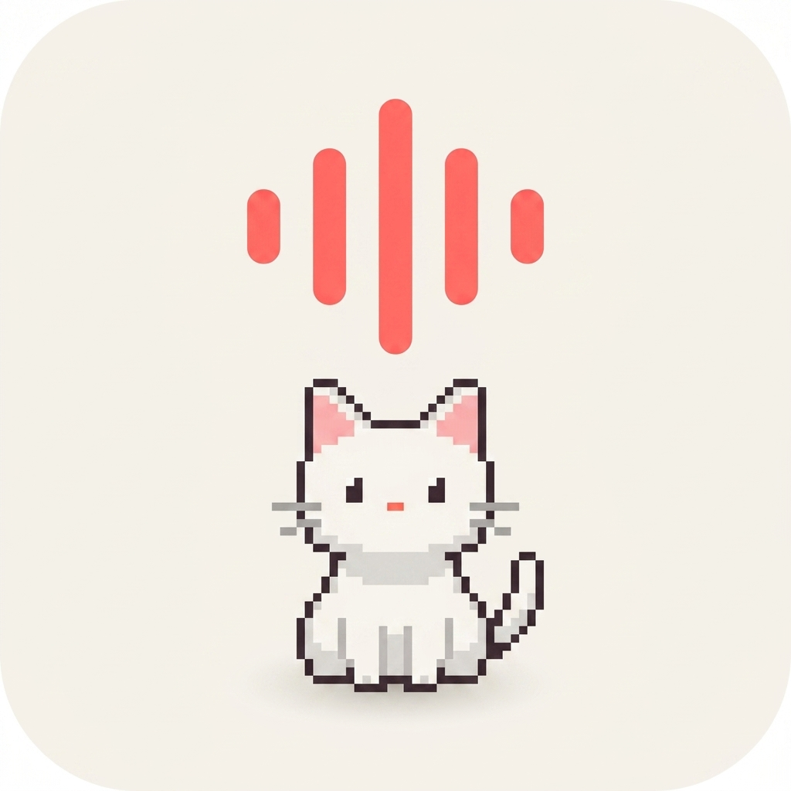

<div align="center">



<h1>TipTour × Hermes</h1>

**Ask your Mac how to do anything. Watch it happen.**

A voice-and-chat AI companion for macOS that lives in the menu bar. Hold a hotkey to talk, open the chat to type, and it sees your screen, talks back, walks you through clicks — or, if you let it, drives your apps for you end-to-end.

[](./LICENSE)
[](https://www.apple.com/macos)

</div>

---

## What it does

Hold **Control + Option** and ask a question naturally:

> *"Where's the File menu in Xcode?"*
>
> *"Click the reload button in Safari."*
>
> *"Walk me through exporting this as an MP4."*
>
> *"Type my email into the signup form and submit it."*

TipTour hears you, sees your screen, and either flies a cursor to the exact UI element (teaching mode) or actually clicks / types / presses shortcuts for you (autopilot mode). For deeper work — code review, multi-step research, anything that needs reading files or running commands — it hands the task to **Hermes**, a bundled Python coding-agent subprocess that talks back through the same conversation.

Works across every Mac app: Xcode, Blender, Figma, VS Code, browsers, GarageBand, games. Native apps get pixel-perfect targeting via the macOS Accessibility tree; apps that render their own UI (Blender, Unity, canvas tools) fall back to Gemini's native spatial grounding.

---

## Features

- 🎤 **Voice-first.** Hold Ctrl+Option and ask — no menus, no search. One streaming WebSocket handles voice in, vision, voice out, and tool calling.
- 💬 **Chat too.** Open the Hermes chat window when you want text, code, or deeper reasoning. Same Mac-controlling tools available to both surfaces.
- 🎯 **Pixel-perfect pointing.** macOS Accessibility tree for native apps (~30ms, exact). Gemini `box_2d` spatial grounding for apps without AX (Blender, Unity, canvases, games).
- 🤖 **Two modes — teach or do.** "Show me how" flies the cursor and waits for you to click. "Do it for me" clicks, types, and presses shortcuts on your behalf. Gated behind a clearly-labelled opt-in toggle ("Hermes can drive my Mac").
- 🪜 **Multi-step walkthroughs.** "How do I X" emits a structured plan. Cursor flies to step 1, advances when you click. Pauses automatically if a modal pops, you Cmd-Tab away, or the click didn't change UI state. Resume/Skip/Stop in the panel.
- 🧠 **Hermes for real work.** Ask for code review, research, file edits, shell — Gemini delegates to Hermes (Python ACP subprocess, Anthropic/OpenAI/Google BYOK). Hermes has its own MCP back-channel into the Mac so it can take screenshots, walk the a11y tree, and drive the same GUI primitives the voice agent uses.
- 🧰 **Background agent swarm.** Long-running tasks ("research X and write a summary") spawn into named agents that run in parallel — each with its own workspace, shell, and skill library. Cancellable from the agent overlay.
- 📚 **Bundled skill library.** ~150 markdown skills (SPARC, OpenCode primitives, agent patterns) ship with the app; agents pull them in by name on demand. Per the agentskills.io spec.
- 🐱 **Neko mode.** Optional — replace the cursor with a pixel-art cat that runs across your screen, leaves paw prints, and falls asleep when idle.
- 🔒 **Permissions respected.** Mic and screen capture only fire during a session. The destructive autopilot tools refuse outright until you flip the toggle.
- 🔑 **Your keys, your machine.** All keys live in macOS Keychain. Element grounding happens on-device. Only voice + screenshots go to Google's Gemini Live API; only Hermes' prompts go to your chosen provider.

---

## Install

A signed + notarized DMG is coming. Until then, build from source — it's four commands (see [below](#building-from-source)).

---

## How it works

```
              Control + Option (hold)         Hermes chat (open from panel)
                       │                              │
                       ▼                              ▼
              ┌────────────────┐            ┌─────────────────────┐
              │  Gemini Live   │            │  Hermes (Python)    │
              │  (3.1 Flash)   │            │  ACP over stdio,    │
              │                │            │  Anthropic / OpenAI │
              │  voice + vision│            │  / Google (BYOK)    │
              │  + tools       │            │                     │
              └────────┬───────┘            └──────────┬──────────┘
                       │                               │
                       │  tools:                       │  MCP tools:
                       │   point_at_element            │   take_screenshot
                       │   click_element               │   get_a11y_tree
                       │   type_text                   │   point_at
                       │   press_keyboard_shortcut     │   click_element
                       │   ask_hermes  ─────────────►──┤   type_text
                       │                               │   press_keyboard_shortcut
                       ▼                               ▼
              ┌──────────────────────────────────────────────────┐
              │            ElementResolver                       │
              │   1. macOS Accessibility tree (~30ms, exact)     │
              │   2. Gemini box_2d spatial grounding (fallback)  │
              └────────────────┬─────────────────────────────────┘
                               ▼
              ┌──────────────────────────────────────────────────┐
              │  ActionExecutor (HID-level CGEvent posts)        │
              │  serialised across all callers via               │
              │  GUIActionMutex — one cursor, one keyboard       │
              └────────────────┬─────────────────────────────────┘
                               ▼
                     🎯 Cursor flies → click / type / shortcut
                        Click it yourself in teaching mode,
                        or it clicks for you in autopilot mode.
```

A few opinionated choices worth calling out:

- **Single-model voice architecture.** One Gemini Live WebSocket handles voice in, vision in, voice out, and tool calling. No STT → LLM → TTS pipeline, no separate planner model. Cuts latency and eliminates cross-component state-sync bugs.
- **Hermes for the hard stuff.** Code, research, file edits, shell — Gemini delegates via `ask_hermes` so the voice agent stays snappy and Hermes can think for as long as it needs.
- **MCP back-channel.** Hermes drives the Mac through the same `ActionExecutor` the voice agent uses, exposed via an MCP server TipTour hosts on localhost. No agent re-implements clicks.
- **Grounding is deterministic.** The LLM emits semantic labels (`"File"`, `"Save"`). Swift code grounds them to pixels via AX tree; Gemini's `box_2d` is the fallback for non-accessible apps. The LLM never picks raw coordinates by hand.
- **One mutex serialises every CGEvent burst.** Voice mode, autopilot, the agent swarm, and Hermes can all want to click at the same instant. `GUIActionMutex` FIFOs them so no interleaved/phantom clicks ever leave the HID layer.
- **Autopilot is opt-in.** A toggle in the menu bar panel's Dev section gates every destructive primitive. Disabled by default; enabling it sets a persistent UserDefaults flag.
- **AX hardening for Electron.** TipTour sets `AXManualAccessibility=true` on every app activation so Electron-based apps (VS Code, Slack, Discord, Cursor, Notion, Figma desktop) expose their full webpage AX tree instead of returning empty.

See [AGENTS.md](AGENTS.md) for the full technical tour.

---

## Building from source

**Requires:** macOS 14+, Xcode 16+.

### 1. Open + run

```bash
open tiptour-macos.xcodeproj
```

Set your signing team in Target → Signing & Capabilities, then `Cmd+R`. TipTour appears in your menu bar — no dock icon, no main window.

### 2. Configure Hermes (Settings → Models)

Click the TipTour menu-bar icon → **Settings** (gear icon in the footer) → **Models** tab.

- Pick a Hermes provider — **Anthropic**, **OpenAI**, or **Google**.
- Paste your API key for that provider. Each key lives in macOS Keychain, never synced.
- Hit **Test** to verify the key against the provider's `/v1/models` endpoint.

This writes a minimal `~/.hermes/config.yaml` so the bundled Hermes runtime can start a session on first ask.

### 3. Add your Gemini Live key

Gemini Live is the voice/vision path (separate from Hermes). Same Settings → Models tab — paste your Gemini key in the Google row. Create one free at [aistudio.google.com/apikey](https://aistudio.google.com/apikey).

### 4. Grant permissions

TipTour asks for these macOS permissions on first launch. Grant them in System Settings → Privacy & Security:

| Permission | Why |
|---|---|
| Microphone | Voice input while holding Control + Option |
| Accessibility | Global hotkey + reading UI element trees + posting clicks/keystrokes |
| Screen Recording | Screenshots for Gemini's visual context |
| Screen Content | ScreenCaptureKit on macOS 15+ |

Plus any of these on first use, depending on what you ask Hermes to do: Apple Events (control other apps via AppleScript), Camera, Photos, Calendars, Reminders, Contacts.

### 5. Opt in to autopilot (optional)

By default TipTour only **points** — it never clicks for you. To let it actually drive your apps, open the panel → **Dev** section → toggle on **Hermes can drive my Mac**. This unlocks `click_element`, `type_text`, and `press_keyboard_shortcut` for both voice and chat.

---

## Roadmap

- [ ] **Guardrails** — per-tool approval prompt with "always allow this tool" memory, replacing the current single-toggle autopilot gate
- [ ] **Background-task scheduling** — "every Monday at 9, summarize my Slack DMs"
- [ ] **Signed DMG + Sparkle auto-updates**
- [ ] **YouTube tutorial follow-along** — paste a YouTube URL, video plays picture-in-picture, cursor flies to the corresponding button in your real app at each instructor action

---

## Contributing

PRs welcome. For non-trivial changes, open an issue first.

Before submitting:
1. Open `tiptour-macos.xcodeproj` in Xcode → verify it builds (⌘B)
2. Run the test suite (⌘U)
3. Any new permission requests need matching `NS*UsageDescription` in `Info.plist`
4. Run through both surfaces end-to-end once — voice (Ctrl+Option) and Hermes chat — to catch regressions

> ⚠️ **Don't run `xcodebuild` from the terminal.** It invalidates TCC permissions and you'll have to re-grant Accessibility, Screen Recording, etc. Use Xcode directly.

See [AGENTS.md](AGENTS.md) for code style and conventions.

---

## Credits

- [Clicky](https://github.com/farzaa/clicky) by [@FarzaTV](https://x.com/farzatv) — the foundation
- [Gemini Live](https://ai.google.dev/gemini-api/docs/live-api) (Google) — realtime voice, vision, and tool calling
- [Hermes](https://github.com/AnthropicAI/hermes) (Anthropic) — the bundled coding-agent runtime
- [RuFlo](https://github.com/ruvnet/ruflo) + [OpenWork](https://github.com/different-ai/openwork) — bundled skill library
- [oneko](https://github.com/crgimenes/neko) — pixel-art cat sprites (Masayuki Koba 1989, BSD-2 port by Cesar Gimenes)

---

<div align="center">

**[MIT License](LICENSE)** · Made by [@milind-soni](https://github.com/milind-soni)

</div>
